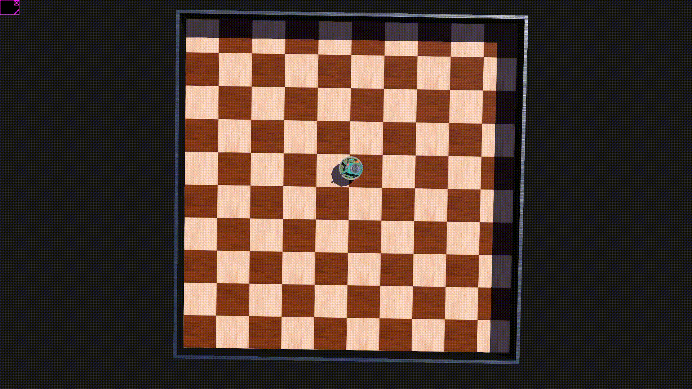

# Laboratorio 1: Simulación de un Robot Móvil Diferencial en Webots

## Información General
* **Asignatura:** Robótica y Sistemas Autónomos 2026-01 
* **Código:** ICI 4150 
* **Herramientas:** Webots, Python 
## Descripción del Laboratorio
El objetivo de esta actividad es comprender y analizar el comportamiento cinemático de un robot móvil diferencial (e-puck) mediante simulaciones interactivas. 
En este modelo, el movimiento del robot es determinado por el control independiente de las velocidades de sus dos ruedas motrices.

### Modelo Cinemático
El movimiento se rige por las siguientes ecuaciones de velocidad lineal ($v$) y velocidad angular ($\omega$):

$$v = \frac{v_{r} + v_{l}}{2}$$
$$\omega = \frac{v_{r} - v_{l}}{L}$$

Donde:
* **$v_{r}$**: Velocidad de la rueda derecha 
* **$v_{l}$**: Velocidad de la rueda izquierda
* **L**: Distancia entre las ruedas
## Integrantes del Equipo
* **Programador:** Carlos Aguirre [Paralelo 2] - Implementación del controlador 
* **Experimentador:** Javier Donetch [Paralelo 2] - Ejecución de pruebas 
* **Analista:** Matthias Julio [Paralelo 1] - Interpretación de resultados 
* **Documentador:** Ignacio Vera [Paralelo 1] - Redacción del informe / Readme
* **Integrador:** Luciano Fredes [Paralelo 2] - Coordinación del trabajo

## Instrucciones de Ejecución
Para reproducir la simulación, siga estos pasos.
1. Instalar y abrir **Webots**.
2. Instalar Python
3. Cargar el mundo que contiene el robot diferencial (e-puck).
4. Configurar el controlador de Python incluido en este repositorio en el nodo del robot.
5. Presionar el botón de reproducción (Play) para observar el comportamiento.

## Resultados y Experimentos
Se realizaron diversas pruebas modificando las velocidades de los motores para observar la trayectoria resultante:

| Configuración | Tipo de Movimiento |
| :--- | :--- |
| $v_{r} = v_{l}$ | Movimiento rectilíneo  |
| $v_{r} \neq v_{l}$ | Trayectoria curva  |
| $v_{r} = -v_{l}$ | Rotación sobre su propio eje  |

### Desafíos Implementados
El controlador ha sido programado para ejecutar las siguientes figuras:
* Línea recta
```python
left_motor.setVelocity(2.0)
right_motor.setVelocity(2.0)
```
* Curva y círculo concéntrico
```python
left_motor.setVelocity(2.5)
right_motor.setVelocity(5.0)

if current_time >= start_time + tiempo_circulo:

            rectas = 0
            estado = 0
            start_time = current_time
```   

* (Opcional) Cuadrado
```python
if estado == 0:  # ESTADO: Recta

            left_motor.setVelocity(2.0)
            right_motor.setVelocity(2.0)

            if current_time >= start_time + tiempo_recta:

                estado = 1
                cont = cont + 1
                start_time = current_time

        elif estado == 1:  # ESTADO: Esquina

            left_motor.setVelocity(3.0)
            right_motor.setVelocity(0)

            if current_time >= start_time + tiempo_giro:
                estado = 0
                start_time = current_time
```  

* Tiempos
```python
tiempo_circulo = 8.0
tiempo_recta = 2.0
tiempo_giro = 1.45
tiempo_pausa = 5.0
```  


## Análisis de Resultados
1.  **Velocidades iguales:** El robot mantiene un avance lineal ya que no existe diferencia de potencial entre los actuadores que genere rotación.
2.  **Velocidades diferentes:** Se genera un radio de giro dependiente de la diferencia entre $v_{r}$ y $v_{l}$. Si una rueda es más veloz, el robot curva hacia el lado opuesto.
3.  **Velocidades opuestas:** Al girar en sentidos contrarios con la misma magnitud, el centro de masa del robot permanece estático mientras el chasis rota sobre su eje central.
4.  **Simulación de círculo:** Para lograr una trayectoria circular constante, se deben mantener velocidades diferentes pero fijas en ambas ruedas. Con el codigo proporcionado, el giro del robot es de 8 segundos.

## Evidencia Visual
*(Incluir aquí capturas de pantalla o enlaces a videos del funcionamiento en Webots)*
## Demostración del robot

