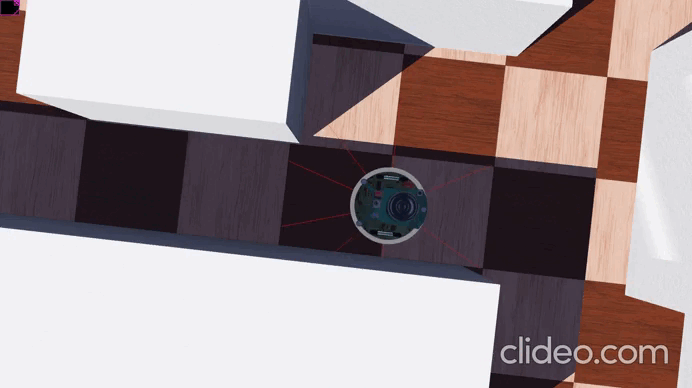

# Laboratorio 2: Navegación Reactiva con Filtrado y Fusión de Sensores en Webots

## Índice de Contenidos

- [Información General](#información-general)
- [Integrantes del Equipo](#integrantes-del-equipo)
- [Objetivo](#objetivo)
- [Descripción del Robot y Sensores](#descripción-del-robot-y-sensores)
- [Frecuencia de Muestreo](#frecuencia-de-muestreo)
- [Análisis de Señales Registradas](#análisis-de-señales-registradas)
- [Estimación del Avance mediante Encoders](#estimación-del-avance-mediante-encoders)
- [Filtro Simple Aplicado](#filtro-simple-aplicado)
- [Filtro de Kalman](#filtro-de-kalman)
- [Lógica de Navegación Reactiva](#lógica-de-navegación-reactiva)
- [Instrucciones de Ejecución](#instrucciones-de-ejecución)
- [Resultados y Experimentos](#resultados-y-experimentos)
- [Evidencia Visual](#evidencia-visual)
- [Análisis Final y Conclusiones](#análisis-final-y-conclusiones)

---

# Información General

- **Asignatura:** Robótica y Sistemas Autónomos 2026-01
- **Código:** ICI 4150
- **Herramientas utilizadas:** Webots, Python

---

# Integrantes del Equipo

| Rol | Integrante |
|---|---|
| Programador | Carlos Aguirre |
| Experimentador | Javier Donetch |
| Analista | Matthias Julio |
| Documentador | Ignacio Vera |
| Integrador | Luciano Fredes |

---

# Objetivo

Implementar un sistema básico de navegación reactiva en Webots para un robot móvil diferencial, utilizando sensores de distancia y encoders de rueda, aplicando filtrado sobre las mediciones y empleando un filtro de Kalman para estimar la distancia frontal a obstáculos y mejorar la toma de decisiones.

---

# Descripción del Robot y Sensores

Se utilizó el robot **e-puck** de Webots, un robot diferencial con dos ruedas motrices independientes y sensores infrarrojos de proximidad.

## Sensores utilizados

| Sensor | Función |
|---|---|
| `ps0`, `ps7` | Sensores frontales |
| `ps6` | Sensor diagonal/lateral izquierdo |
| `ps1` | Sensor diagonal/lateral derecho |
| Encoder izquierdo | Medición angular rueda izquierda |
| Encoder derecho | Medición angular rueda derecha |

Los sensores infrarrojos entregan valores proporcionales a la cercanía de obstáculos. Los encoders permiten estimar el movimiento lineal del robot a partir del giro de las ruedas.

---

# Frecuencia de Muestreo

El controlador utiliza un paso de simulación fijo:

| Parámetro | Valor |
|---|---|
| Tiempo de muestreo ($T_s$) | 0.032 s |
| Frecuencia de muestreo ($f_s$) | 31.25 Hz |

```python
TIME_STEP = 32
```

Todas las señales registradas fueron analizadas utilizando esta frecuencia de muestreo.

---

# Análisis de Señales Registradas

Durante la simulación se registraron:

- señales crudas de sensores IR
- señales filtradas
- estimación Kalman
- valores de encoders

## Señales crudas

Las mediciones presentan ruido significativo y variaciones rápidas incluso bajo movimiento uniforme.

## Señales filtradas

La media móvil reduce considerablemente las oscilaciones de alta frecuencia.

## Señal estimada mediante Kalman

La estimación fusionada presenta el comportamiento más estable, reduciendo ruido y evitando decisiones erráticas.

```python
raw_front_log.append(raw_front)
filtered_front_log.append(filtered_front)
kalman_front_log.append(d_est)
```

---

# Estimación del Avance mediante Encoders

Los encoders del e-puck entregan medidas angulares en radianes.

La conversión a desplazamiento lineal se realiza mediante:

$$
s = r\theta
$$

donde:

- $s$: desplazamiento lineal
- $r$: radio de la rueda
- $\theta$: desplazamiento angular

Se utilizó:

```python
WHEEL_RADIUS = 0.0205
```

El avance promedio del robot se estima mediante:

$$
\Delta d_k = \frac{s_{izq} + s_{der}}{2}
$$

Implementación:

```python
delta_left = (
    (cur_left_enc - prev_left_enc)
    * WHEEL_RADIUS
)

delta_right = (
    (cur_right_enc - prev_right_enc)
    * WHEEL_RADIUS
)

delta_d = (delta_left + delta_right) / 2.0
```

---

# Filtro Simple Aplicado

Antes de aplicar Kalman se utilizó un filtro de media móvil:

$$
\hat{z}_k =
\frac{1}{N}
\sum_{i=0}^{N-1} z_{k-i}
$$

Implementación:

```python
FILTER_WIN = 5

filtered_front = moving_average(
    front_buffer,
    raw_front,
    FILTER_WIN
)
```

Este filtro suaviza las variaciones rápidas de los sensores infrarrojos.

---

# Filtro de Kalman

Se implementó un filtro de Kalman escalar para estimar la distancia frontal al obstáculo más cercano.

---

## Variable de estado

$$
d_k = \text{distancia frontal estimada}
$$

---

## Predicción

La distancia estimada disminuye según el avance del robot:

$$
\hat{d}_k^- =
\hat{d}_{k-1} - \Delta d_k
$$

y:

$$
P_k^- = P_{k-1} + Q
$$

Implementación:

```python
d_pred = d_est - delta_d
P_pred = P_est + Q
```

---

## Corrección

La medición proviene del sensor frontal filtrado y calibrado:

```python
z_k = ir_to_meters(filtered_front)
```

Ganancia de Kalman:

$$
K_k =
\frac{P_k^-}{P_k^- + R}
$$

Actualización:

$$
\hat{d}_k =
\hat{d}_k^- +
K_k(z_k - \hat{d}_k^-)
$$

```python
K = P_pred / (P_pred + R)

d_est = d_pred + K * (z_k - d_pred)

P_est = (1.0 - K) * P_pred
```

---

## Parámetros utilizados

| Parámetro | Valor |
|---|---|
| $Q$ | 0.001 |
| $R$ | 0.05 |
| $P_0$ | 0.1 |
| $\hat{d}_0$ | 0.40 m |

---

# Lógica de Navegación Reactiva

La navegación utiliza:

- distancia frontal estimada
- sensores laterales
- evasión preventiva diagonal

---

## Avance frontal

Si:

$$
\hat{d}_k > 0.15
$$

el robot avanza.

---

## Obstáculo frontal

Si:

$$
\hat{d}_k \leq 0.15
$$

el robot entra en modo evasión.

La dirección de giro se decide usando sensores laterales:

```python
if lateral_left > lateral_right:
    direccion_giro = 1
else:
    direccion_giro = -1
```

---

## Evasión lateral inteligente

Se agregó un sistema de prevención de colisiones diagonales utilizando los sensores `ps6` y `ps1`.

Esto permite detectar paredes laterales antes de que entren al cono frontal.

Ejemplo:

```python
if lateral_left > LATERAL_ALERT:

    left_speed = MAX_SPEED * 0.9
    right_speed = MAX_SPEED * 0.3

elif lateral_right > LATERAL_ALERT:

    left_speed = MAX_SPEED * 0.3
    right_speed = MAX_SPEED * 0.9
```

Este mecanismo reduce significativamente las colisiones en esquinas y pasillos estrechos.

---

# Instrucciones de Ejecución

1. Instalar Webots.
2. Instalar Python 3.
3. Clonar o descargar el repositorio.
4. Abrir el archivo `.wbt`.
5. Seleccionar el robot e-puck.
6. Asignar el controlador:

```text
lab2controller_epuck.py
```

7. Ejecutar la simulación.

---

# Resultados y Experimentos

Se realizaron pruebas en dos escenarios.

---

## Escenario simple

Pocos obstáculos y espacio abierto.

| Métrica | Señal cruda | Filtro simple | Kalman |
|---|---|---|---|
| Estabilidad | Baja | Media | Alta |
| Giros innecesarios | Muchos | Moderados | Pocos |
| Colisiones | Algunas | Pocas | Ninguna |

---

## Escenario complejo

Pasillos estrechos y obstáculos múltiples.

| Métrica | Señal cruda | Filtro simple | Kalman |
|---|---|---|---|
| Estabilidad | Muy baja | Media | Alta |
| Giros innecesarios | Muy frecuentes | Moderados | Pocos |
| Colisiones | Frecuentes | Ocasionales | Ninguna |

---

# Evidencia Visual

## Robot en funcionamiento
### Escenario simple
Prueba básica del robot en un entorno abierto con un único obstáculo.


### Escenario complejo
Navegación reactiva completa en pasillos estrechos y múltiples obstáculos utilizando:

- sensores IR
- filtrado de media móvil
- filtro de Kalman
- evasión lateral inteligente




## Señales registradas

```text
graficos_senales.png
```

---

# Análisis Final y Conclusiones

## Comparación entre señales

Las señales crudas presentan ruido considerable y provocan oscilaciones frecuentes.

La media móvil reduce parte de estas fluctuaciones, aunque introduce un pequeño retardo.

El filtro de Kalman produce la estimación más estable y confiable al fusionar:

- movimiento estimado por encoders
- percepción del entorno mediante sensores IR

---

## Predicción mediante encoders

La relación:

$$
s = r\theta
$$

permite estimar el avance del robot entre muestras consecutivas.

Esto mejora significativamente la estabilidad del sistema frente al ruido de sensores.

---

## Uso de sensores laterales

La incorporación de evasión lateral preventiva permitió detectar paredes diagonales antes de una colisión frontal.

Esto mejoró especialmente:

- navegación en esquinas
- pasillos estrechos
- estabilidad del movimiento

---

## Conclusiones principales

1. El filtro de media móvil reduce ruido pero introduce retardo.
2. El filtro de Kalman entrega estimaciones más robustas.
3. La fusión sensorial mejora considerablemente la navegación.
4. Los sensores laterales son fundamentales para evitar colisiones diagonales.
5. La navegación reactiva basada en Kalman reduce giros innecesarios y evita colisiones.
